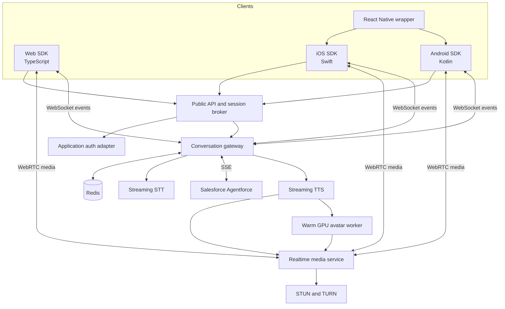
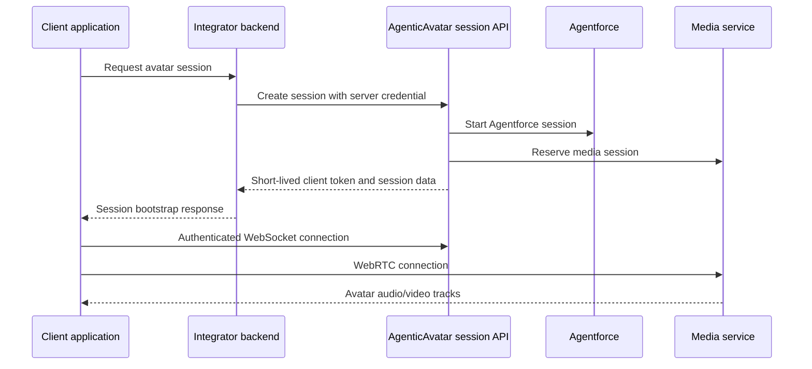
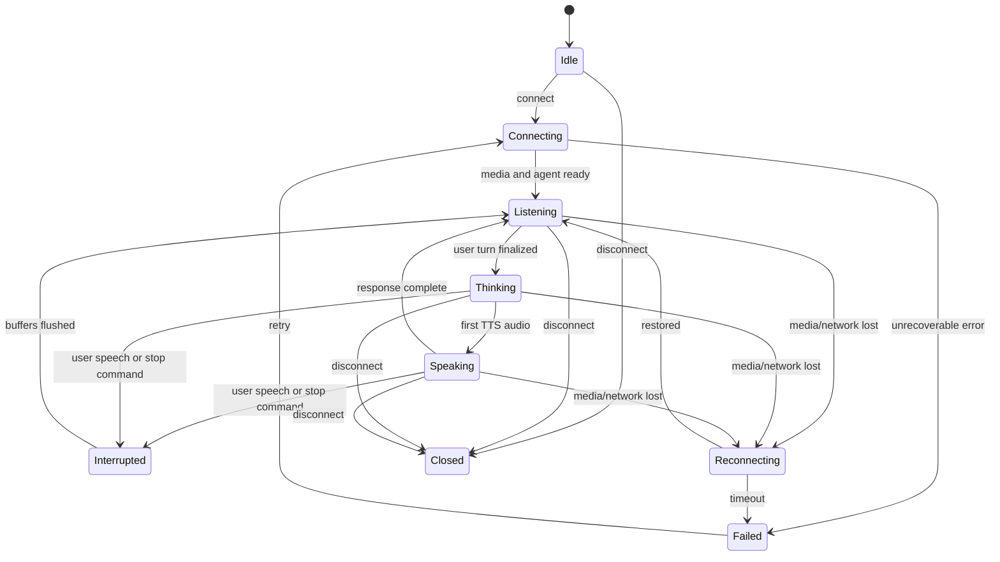

# AgenticAvatar Comprehensive Implementation Plan

Implementation plan for a real-time Salesforce Agentforce avatar that can be embedded in web applications and native mobile applications.

This document complements [README.md](./README.md). The README defines the target architecture and technology choices. This plan defines delivery order, component ownership, interfaces, platform integration, testing, deployment, and acceptance criteria.

For a deliberately phased browser-POC-to-product sequence, use [PROGRESSIVE_IMPLEMENTATION_PLAN.md](./PROGRESSIVE_IMPLEMENTATION_PLAN.md).

## 1. Outcome

Build AgenticAvatar as a reusable platform with four integration surfaces:

1. **Web SDK** for React, Next.js, and framework-independent browser applications.
2. **iOS SDK** distributed as a Swift Package.
3. **Android SDK** distributed as an Android Archive through Maven.
4. **React Native wrapper** over the iOS and Android SDKs, added after the native SDKs stabilize.

All clients use the same backend session, event, authentication, and WebRTC contracts. Salesforce credentials, speech-provider credentials, and model infrastructure remain on the backend.

The initial user experience is a half-body or portrait avatar with:

- Real-time microphone conversation.
- Streamed Agentforce responses.
- Synchronized speech and facial animation.
- Listening, thinking, speaking, interrupted, and error states.
- User barge-in while the avatar is speaking.
- Mute, speaker, camera/avatar visibility, and end-session controls.
- Text transcript as an accessible alternative.

## 2. Scope

### Version 1 scope

- One user and one avatar per session.
- English initially, with locale passed through every API.
- A controlled catalog of pre-approved avatar portraits and voices.
- Foreground browser and foreground mobile operation.
- WebRTC audio/video delivery.
- WebSocket control and transcript events.
- Salesforce Agentforce as the agent runtime.
- Streaming STT and TTS adapters.
- Self-hosted Ditto-based GPU avatar renderer.
- Google Cloud reference deployment.
- AWS deployment parity after the Google Cloud MVP is stable.
- Web, iOS, and Android sample applications.

### Explicitly deferred

- Arbitrary end-user avatar uploads.
- Voice cloning without a dedicated consent workflow.
- Multiple avatars in one session.
- Full-body animation.
- Guaranteed background conversations on mobile.
- PSTN/telephone integration.
- Offline operation.
- Training a proprietary avatar model.
- Multi-region active-active deployment.

## 3. Product and technical principles

1. **One protocol, multiple clients.** Platform differences are handled in SDK adapters, not backend forks.
2. **Media uses WebRTC.** WebSocket carries control events, not video frames.
3. **Audio is the master clock.** Late video frames are dropped rather than delaying speech.
4. **Everything streams.** Do not wait for complete recordings, Agentforce replies, TTS files, or rendered videos.
5. **Interruption is fundamental.** Every service and message supports cancellation.
6. **GPU workers remain warm.** Scale-to-zero is not compatible with the latency objective.
7. **Credentials remain server-side.** Clients receive short-lived application and media tokens only.
8. **SDKs expose state, not infrastructure details.** Applications should not understand Salesforce SSE or GPU worker protocols.
9. **Accessibility is part of the SDK.** Captions, text interaction, and reduced-motion behavior are supported from the first public release.
10. **Measure before optimizing.** Every conversation turn has an end-to-end distributed trace.

## 4. Target architecture



## 5. Repository structure

```text
AgenticAvatar/
├── apps/
│   ├── web-demo/                       # Next.js SDK demonstration
│   ├── ios-demo/                       # SwiftUI sample application
│   ├── android-demo/                   # Jetpack Compose sample application
│   └── react-native-demo/              # Added after native SDK stabilization
├── sdk/
│   ├── web/                            # TypeScript core and React components
│   ├── ios/                            # Swift Package
│   ├── android/                        # Kotlin Android library
│   ├── react-native/                   # Thin native bridge
│   └── conformance/                    # Shared protocol fixtures/test vectors
├── services/
│   ├── session-api/                    # Public session/token broker
│   ├── gateway/                        # Agentforce/STT/TTS orchestration
│   ├── media/                          # WebRTC integration
│   └── avatar-worker/                  # CUDA/TensorRT inference
├── packages/
│   ├── contracts/                      # OpenAPI, AsyncAPI, Protobuf schemas
│   ├── agentforce-adapter/
│   ├── stt-adapters/
│   ├── tts-adapters/
│   └── telemetry/
├── infra/
│   ├── modules/
│   ├── gcp/
│   └── aws/
├── models/                             # Manifests/checksums, not weights
├── docs/
│   ├── web-integration.md
│   ├── ios-integration.md
│   ├── android-integration.md
│   ├── react-native-integration.md
│   ├── protocol.md
│   ├── operations.md
│   └── security-and-privacy.md
├── tests/
│   ├── integration/
│   ├── end-to-end/
│   ├── load/
│   ├── network/
│   └── media-quality/
├── README.md
└── IMPLEMENTATION_PLAN.md
```

## 6. Public integration model

An integrating application owns user authentication. Its trusted backend exchanges that identity for a short-lived AgenticAvatar session. Native or browser code must not contain a permanent AgenticAvatar, Salesforce, STT, or TTS secret.

### Required integration sequence



### Server-to-server request

```http
POST /v1/sessions
Authorization: Bearer <server-api-key-or-workload-token>
Idempotency-Key: <uuid>
Content-Type: application/json

{
  "externalUserId": "opaque-user-reference",
  "avatarId": "support-agent-01",
  "agentId": "salesforce-agent-alias",
  "locale": "en-US",
  "clientPlatform": "ios",
  "capabilities": {
    "videoCodecs": ["H264"],
    "audioCodecs": ["opus"],
    "captions": true,
    "bargeIn": true
  },
  "metadata": {
    "tenantId": "tenant-123"
  }
}
```

### Bootstrap response

```json
{
  "sessionId": "ses_01...",
  "clientToken": "short-lived-jwt",
  "clientTokenExpiresAt": "2026-08-31T18:30:00Z",
  "eventsUrl": "wss://api.example.com/v1/sessions/ses_01/events",
  "media": {
    "provider": "livekit",
    "url": "wss://media.example.com",
    "token": "short-lived-media-token"
  },
  "iceServers": [],
  "features": {
    "captions": true,
    "textInput": true,
    "bargeIn": true
  }
}
```

The bootstrap token should expire in approximately five minutes. The active session can continue through a separate renewable session lease. Never put Salesforce access tokens in this response.

## 7. Shared SDK contract

All SDKs should provide equivalent concepts and behavior.

### Core configuration

```text
AvatarClientConfiguration
├── bootstrapProvider() -> SessionBootstrap
├── locale
├── preferredAvatarId
├── autoConnect
├── captionsEnabled
├── bargeInEnabled
├── audioOutputPolicy
└── telemetryPolicy
```

### Core methods

```text
connect()
disconnect()
startListening()
stopListening()
sendText(text)
interrupt()
setMicrophoneEnabled(enabled)
setRemoteAudioEnabled(enabled)
setVideoEnabled(enabled)
selectAudioOutput(device)       # when the platform permits
setCaptionsEnabled(enabled)
```

### Observable state

```text
idle
connecting
ready
listening
thinking
speaking
interrupted
reconnecting
failed(error)
closed
```

### Events

- Connection state changed
- Conversation state changed
- Partial user transcript
- Final user transcript
- Agent text delta
- Final agent message
- Audio level changed
- Active speaker changed
- Permission required/denied
- Reconnecting/reconnected
- Rate limit reached
- Recoverable and terminal errors
- Session expiring/expired

### Error taxonomy

All SDKs map platform errors to shared categories:

- `authentication`
- `permission`
- `network`
- `mediaNegotiation`
- `microphoneUnavailable`
- `audioRoute`
- `sessionExpired`
- `capacityUnavailable`
- `agentUnavailable`
- `speechRecognition`
- `speechSynthesis`
- `avatarRendering`
- `unsupportedPlatform`
- `internal`

Each error contains a stable code, user-safe message, retryability flag, correlation ID, and optional platform cause. Never expose secrets or raw upstream responses.

## 8. Web SDK implementation

### Packages

Publish:

- `@agentic-avatar/core`: framework-independent TypeScript client.
- `@agentic-avatar/react`: hooks and accessible UI primitives.
- `@agentic-avatar/web`: browser media adapters if separated from core.

### Browser requirements

- Secure context (`https://`) except localhost.
- WebRTC support.
- `getUserMedia` microphone support.
- WebSocket support.
- Web Audio API and `AudioWorklet`.
- Page visibility and network-status handling.

### React integration target

```tsx
import {
  AgenticAvatarProvider,
  AvatarVideo,
  Captions,
  useAgenticAvatar,
} from "@agentic-avatar/react";

function SupportAvatar() {
  return (
    <AgenticAvatarProvider
      getSessionBootstrap={() => fetch("/api/avatar/session").then(r => r.json())}
      captions
      bargeIn
    >
      <AvatarExperience />
    </AgenticAvatarProvider>
  );
}

function AvatarExperience() {
  const avatar = useAgenticAvatar();

  return (
    <section aria-label="AI support assistant">
      <AvatarVideo fit="cover" poster="/avatar-placeholder.webp" />
      <Captions ariaLive="polite" />
      <button onClick={() => avatar.setMicrophoneEnabled(!avatar.microphoneEnabled)}>
        {avatar.microphoneEnabled ? "Mute" : "Unmute"}
      </button>
      <button onClick={() => avatar.interrupt()}>Stop</button>
      <button onClick={() => avatar.disconnect()}>End</button>
    </section>
  );
}
```

### Browser-specific behavior

- Request microphone access only from a user gesture.
- Handle autoplay restrictions by requiring a visible “Start conversation” action.
- Use an `AudioWorklet` instead of deprecated `ScriptProcessorNode`.
- Suspend capture when the page is hidden only according to product policy; warn the host application through an event.
- Handle device changes through `navigator.mediaDevices.devicechange`.
- Permit users to choose microphone/output devices where browser APIs allow it.
- Provide a text-only fallback when media permissions are denied.
- Ensure captions are screen-reader compatible without announcing every partial token.
- Support reduced motion by keeping video optional while audio and captions continue.

### Browser support target

Initial support:

- Latest two stable versions of Chrome and Edge.
- Latest two stable versions of Safari on macOS and iOS.
- Latest two stable versions of Firefox.

Automated tests must run in Chromium, WebKit, and Firefox. Real-device Safari tests remain mandatory because simulated media behavior is insufficient.

## 9. iOS SDK implementation

### Distribution

- Swift Package Manager.
- Minimum supported iOS version chosen during Phase 0 based on product audience and WebRTC dependency support.
- Public module: `AgenticAvatarSDK`.
- Optional SwiftUI module: `AgenticAvatarUI`.

### Main types

```swift
public final class AgenticAvatarClient: ObservableObject {
    @Published public private(set) var state: AvatarState
    @Published public private(set) var userTranscript: String
    @Published public private(set) var agentTranscript: String

    public init(configuration: AvatarConfiguration)
    public func connect() async throws
    public func disconnect() async
    public func setMicrophoneEnabled(_ enabled: Bool) async throws
    public func sendText(_ text: String) async throws
    public func interrupt() async
}
```

Provide both Swift concurrency and delegate/Combine integration where practical.

### iOS media implementation

- Use the native WebRTC iOS library or the selected media provider's native SDK.
- Configure `AVAudioSession` for two-way voice communication.
- Default to `.playAndRecord` with `.voiceChat` mode after evaluating audio quality.
- Support speaker, receiver, wired headset, Bluetooth HFP, and supported external routes.
- Observe route changes and interruptions.
- Restore state correctly after phone calls, Siri, alarms, and other audio-session interruptions.
- Render the remote video track through a native Metal-backed WebRTC video view.
- Keep network and media work off the main actor; publish UI state on the main actor.

### iOS lifecycle behavior

- Foreground conversation is the Version 1 guarantee.
- When the app enters background, stop or gracefully suspend the avatar session unless the product has a separately approved background-audio use case.
- On foreground return, renew tokens and reconnect when the session lease remains valid.
- Handle network transitions between Wi-Fi and cellular without creating duplicate sessions.
- Treat microphone permission denial as recoverable through Settings guidance and text input.

### iOS privacy requirements

- Add a clear `NSMicrophoneUsageDescription` supplied by the integrating app.
- Document required privacy-manifest entries.
- Do not require camera permission; the avatar receives microphone audio only.
- Provide APIs allowing host applications to display recording and AI disclosures.

### SwiftUI component target

```swift
AgenticAvatarView(client: client)
    .avatarContentMode(.fill)
    .captionsEnabled(true)
    .onAvatarError { error in
        // Host application handling
    }
```

Also expose the underlying video renderer for UIKit applications.

## 10. Android SDK implementation

### Distribution

- Android Archive published to a private or public Maven repository.
- Kotlin-first API with Java interoperability.
- Public modules: `agentic-avatar-core` and optional `agentic-avatar-compose`.
- Minimum Android API level selected during Phase 0 based on audience and WebRTC dependency support.

### Main types

```kotlin
class AgenticAvatarClient(
    configuration: AvatarConfiguration,
    coroutineScope: CoroutineScope,
) {
    val state: StateFlow<AvatarState>
    val userTranscript: StateFlow<String>
    val agentTranscript: StateFlow<String>

    suspend fun connect()
    suspend fun disconnect()
    suspend fun setMicrophoneEnabled(enabled: Boolean)
    suspend fun sendText(text: String)
    suspend fun interrupt()
}
```

### Android media implementation

- Use the native WebRTC Android library or selected media provider's Android SDK.
- Use `AudioManager` communication mode while connected.
- Support speaker, earpiece, wired devices, and Bluetooth communication routes.
- Request and release audio focus correctly.
- Render remote video using `SurfaceViewRenderer` or the media SDK's native renderer.
- Use Kotlin coroutines and `StateFlow` for asynchronous state.
- Bind long-lived work to an explicit SDK/session scope, never a global unbounded scope.

### Android lifecycle behavior

- Integrate with `LifecycleOwner` without forcing the host application to use Compose.
- Foreground conversation is the Version 1 guarantee.
- Stop or suspend the session when the application backgrounds unless a separately designed foreground-service experience is enabled.
- Handle activity recreation without starting a second backend session.
- Handle Wi-Fi/cellular transitions and temporary network loss.
- Release the renderer, microphone, EGL context, and peer connection deterministically.

### Android permissions

- Require `RECORD_AUDIO`.
- Require network permissions.
- Bluetooth permissions depend on the supported Android versions and route behavior.
- Do not request camera permission.
- Expose permission state to the host app rather than displaying uncustomizable dialogs inside the core SDK.

### Compose component target

```kotlin
AgenticAvatar(
    client = client,
    modifier = Modifier.fillMaxSize(),
    captionsEnabled = true,
    onError = { error -> /* host handling */ },
)
```

Also expose a traditional Android `View` for XML/View-based applications.

## 11. React Native wrapper

Do not implement the realtime media path independently in JavaScript. Wrap the stable iOS and Android SDKs so media capture, audio routing, video rendering, and lifecycle behavior remain native.

The React Native package should provide:

- A native avatar view component.
- Promise-based commands for connection and controls.
- Event emitters for state and transcripts.
- TypeScript definitions matching the shared contract.
- Expo development-build compatibility if the native dependencies permit it; Expo Go is not assumed.

Target interface:

```tsx
<AgenticAvatarView
  sessionBootstrap={bootstrap}
  captionsEnabled
  bargeInEnabled
  onStateChanged={setState}
  onTranscript={handleTranscript}
  onError={handleError}
/>
```

React Native starts only after native SDK media, lifecycle, and error contracts have passed conformance tests. This avoids three competing mobile implementations.

## 12. Realtime media plan

### Codec baseline

- Audio: Opus, mono, typically 48 kHz within WebRTC.
- Browser-to-STT conversion: convert to the provider-required format server-side or in a media processor.
- Video: H.264 for broad native mobile compatibility, with VP8 as a web fallback when needed.
- Initial output: 512×512 at 25 FPS.
- Keyframes: on join, reconnect, and periodically according to media-server guidance.

### Synchronization

- Timestamp TTS PCM as soon as it enters the media pipeline.
- Give generated video frames presentation timestamps derived from the matching audio range.
- Maintain a short jitter/render buffer.
- Never slow audio to wait for video.
- Drop stale video frames and request a keyframe after severe delay.
- Alert when audio/video offset exceeds the defined threshold.

### Connectivity

- Attempt direct UDP through ICE/STUN.
- Provide TURN/UDP fallback.
- Provide TURN/TLS over TCP 443 for restrictive enterprise networks.
- Use short-lived TURN credentials.
- Collect the selected ICE candidate type without logging IP addresses unnecessarily.

### Reconnection

- Use exponential backoff with jitter and a strict maximum reconnect window.
- Preserve the logical conversation session during short media reconnects.
- Refresh expired client/media tokens through the host backend.
- Prevent duplicated microphones and remote tracks after reconnection.
- Close and create a new session after an unrecoverable lease expiration.

## 13. Backend implementation workstreams

### Session API

Deliverables:

- Server-to-server authentication.
- Tenant and user authorization.
- Idempotent session creation.
- Short-lived client/media token issuance.
- Agent/avatar/voice configuration resolution.
- Rate limits and concurrency limits.
- Session lease renewal and termination.
- Audit events containing IDs and outcomes, not sensitive content.

### Conversation gateway

Deliverables:

- Agentforce OAuth and session lifecycle adapter.
- Salesforce streaming SSE parser.
- Streaming STT adapter interface and first provider.
- Streaming TTS adapter interface and first provider.
- Phrase chunker.
- Conversation state machine.
- Barge-in and cancellation propagation.
- Redis session state with TTL.
- OpenTelemetry tracing.

### Media service

Deliverables:

- WebRTC room/session creation.
- Client microphone subscription.
- STT audio routing.
- Synthesized audio publishing.
- Avatar video publishing.
- TURN integration.
- Session health and quality statistics.
- Track replacement and reconnect handling.

### Avatar worker

Deliverables:

- Reproducible CUDA/TensorRT container.
- Model and license manifest with checksums.
- Offline avatar preprocessing.
- Session open/stream/close gRPC implementation.
- Audio-driven motion generation.
- Idle/listening state generation.
- NVENC video encoding.
- Cancellation and buffer flushing.
- Readiness benchmark and GPU telemetry.

## 14. Conversation state machine



The backend is authoritative for conversation turns. The client is authoritative for immediate local microphone and playback actions. For example, the client stops playback immediately on barge-in while the server completes distributed cancellation.

## 15. Interruption implementation

Every turn has:

- `sessionId`
- `turnId`
- Monotonically increasing `generation`
- Per-stream sequence number
- Media timestamp

Interruption sequence:

1. Client VAD detects user speech over a tuned threshold.
2. Client locally attenuates/stops avatar audio within 100 ms.
3. Client sends `turn.interrupt` over WebSocket.
4. Gateway increments `generation` atomically in Redis.
5. Gateway cancels active TTS and stops accepting old Agentforce deltas.
6. Avatar worker discards buffered inputs/frames from prior generations.
7. Media service discards queued packets after the interruption boundary.
8. All services ignore subsequent stale events carrying the old generation.
9. Avatar returns to listening motion.

Acceptance target: interruption-to-silence p95 below 250 ms on a healthy network.

## 16. Authentication and tenant isolation

### Trust boundaries

- Integrator backend → Session API: long-lived server credential or workload identity.
- Client → public AgenticAvatar services: short-lived session JWT.
- Client → media service: separate short-lived room token.
- Service → service: workload identity/mTLS where supported.
- Gateway → Salesforce/STT/TTS: provider credentials from secret storage.

### Session JWT claims

Include:

- Issuer and audience.
- Session ID.
- Opaque application user ID.
- Tenant ID.
- Avatar ID.
- Allowed capabilities.
- Issued-at, not-before, and expiration.
- Unique token ID.

Do not include PII, Salesforce tokens, provider keys, raw prompts, or transcripts.

Redis keys, object-storage paths, metrics, and worker leases must be tenant-scoped. Enforce tenant identity on every request rather than trusting client-provided metadata.

## 17. Privacy, safety, and accessibility

### Privacy

- Process microphone audio transiently by default.
- Do not store recordings unless the product explicitly enables them and obtains consent.
- Configure transcript retention per tenant and jurisdiction.
- Provide deletion APIs and operational deletion verification.
- Document all subprocessors handling audio, transcript, and avatar data.
- Prevent sensitive content from entering logs and traces.

### Avatar and voice safety

- Use approved portraits and voices only.
- Record subject consent, provenance, allowed uses, and expiration.
- Display an AI-avatar disclosure.
- Consider a visible or encoded watermark.
- Block impersonation of public figures and unauthorized individuals.
- Replace or license dependencies restricted to noncommercial use.

### Accessibility

- Always offer captions and text input.
- Use platform accessibility labels for all controls.
- Do not rely on color alone for conversation state.
- Allow avatar video/reduced motion to be disabled while retaining speech and captions.
- Ensure web keyboard navigation and visible focus.
- Support Dynamic Type and VoiceOver on iOS.
- Support font scaling and TalkBack on Android.
- Avoid sending every partial transcript token to screen readers.

## 18. Observability and service objectives

### Key latency objectives

| Metric | Initial objective |
| --- | ---: |
| End of user turn → first audible response, p50 | < 800 ms |
| End of user turn → first audible response, p95 | < 1.8 s |
| Interrupt → local silence, p95 | < 150 ms |
| Interrupt → pipeline cancellation, p95 | < 250 ms |
| Avatar output frame rate | ≥ 25 FPS |
| A/V synchronization offset, p95 | within ±80 ms |
| Session connection time, p95 | < 3 s with warm capacity |

### Reliability objectives for MVP

- Successful session establishment: at least 99.5% excluding client permission denial.
- Crash-free mobile sessions: at least 99.5%.
- Thirty-minute session without unrecoverable A/V drift.
- No stale speech after a confirmed interruption.
- No secrets or raw tokens in client bundles, logs, or telemetry.

### Client telemetry

Collect with user/tenant policy controls:

- SDK/platform/app version.
- State transitions.
- Connection/reconnection times.
- WebRTC RTT, jitter, packet loss, and selected codec.
- Frame decode/render rate.
- Audio route category.
- Permission outcomes.
- Stable error codes and trace IDs.

Avoid persistent device identifiers and raw content.

## 19. Test matrix

### Web

- Chrome, Edge, Safari, and Firefox target versions.
- Desktop and mobile browsers.
- Microphone allow, deny, revoke, and device removal.
- Autoplay blocked.
- Tab hidden/restored.
- Wi-Fi to cellular transition on mobile browsers.
- TURN-only enterprise network.
- Keyboard and screen-reader operation.

### iOS

- Supported iOS versions on physical devices.
- Speaker, receiver, wired headset, Bluetooth.
- Incoming phone/Siri/audio interruption.
- Foreground/background/foreground.
- Wi-Fi/cellular handoff.
- Permission denied and later enabled in Settings.
- SwiftUI and UIKit host applications.
- Memory pressure and thermal throttling.

### Android

- Supported API levels and representative manufacturers.
- Speaker, earpiece, wired headset, Bluetooth.
- Audio focus loss and recovery.
- Activity recreation and process pressure.
- Foreground/background/foreground.
- Wi-Fi/cellular handoff.
- Permission denial and “don't ask again.”
- Compose and View-based host applications.

### Shared scenarios

- Interrupt during STT, Agentforce, TTS, avatar generation, and playback.
- Agentforce actions taking several seconds.
- STT/TTS upstream timeout.
- GPU worker failure and capacity exhaustion.
- Token expiry during connection and active session.
- Duplicate create-session requests.
- Out-of-order and duplicated WebSocket messages.
- High RTT, jitter, packet loss, and bandwidth limitation.
- At least 30 minutes of continuous conversation.

## 20. CI/CD plan

### Pull-request checks

- Formatting, linting, and static analysis.
- Unit and contract tests.
- OpenAPI/Protobuf compatibility check.
- Dependency vulnerability and license scan.
- Secret scan.
- Docker image build.
- Web browser smoke tests.
- iOS simulator compilation.
- Android emulator compilation/tests.

### Main-branch checks

- Integration environment deployment.
- Agentforce sandbox integration tests.
- WebRTC synthetic-client tests.
- GPU worker smoke and readiness benchmark.
- iOS/Android physical-device test subset.
- End-to-end latency report.

### Release process

- Version all SDKs using semantic versioning.
- Keep protocol additions backward-compatible within a major version.
- Publish generated release notes and migration instructions.
- Sign mobile artifacts and container images.
- Produce a software bill of materials.
- Promote immutable container digests between environments.
- Roll out backend changes gradually before making new SDK capabilities default.

## 21. Deployment environments

### Local development

- CPU gateway/session services through Docker Compose.
- Local Redis.
- Provider sandboxes/mocks.
- Remote development GPU worker when developers lack NVIDIA hardware.
- Local WebRTC with development TLS where required.

### Integration

- Shared Agentforce sandbox.
- One warm GPU.
- Restricted test users.
- Synthetic load and failure injection.

### Staging

- Production-like networking, TURN, IAM, secrets, and scaling.
- Separate Salesforce connected app and agent configuration.
- Real mobile signing and distribution to internal testers.
- No production customer data.

### Production

- Region near primary users.
- Minimum warm CPU and GPU capacity.
- Autoscaling with an admission-control limit.
- Private GPU worker network.
- On-call alerts and documented runbooks.
- Backups only for durable configuration/data; ephemeral audio is not backed up.

## 22. Delivery phases

Durations are estimates for a small experienced cross-functional team and should be recalibrated after Phase 0.

### Phase 0 — discovery, contracts, and benchmarks

Estimated duration: 2 weeks.

Work:

- Confirm Salesforce Agentforce streaming authentication and sandbox access.
- Select media architecture: managed LiveKit, self-hosted LiveKit, or aiortc prototype.
- Benchmark two STT and two streaming TTS candidates.
- Run Ditto with an approved portrait and representative TTS audio.
- Benchmark L4 and stronger GPU capacity including encoding.
- Complete initial dependency/model licensing review.
- Define OpenAPI, WebSocket event schema, and avatar gRPC protocol.
- Select minimum iOS and Android versions.
- Produce UX flows for permission, connecting, listening, thinking, speaking, interruption, and failure.

Exit criteria:

- Avatar pipeline sustains at least 25 FPS.
- One cloud GPU class is selected.
- STT/TTS providers meet preliminary latency requirements.
- Protocol v1 is reviewed by web, iOS, Android, backend, and security owners.
- No unresolved licensing blocker for the prototype.

### Phase 1 — offline backend vertical slice

Estimated duration: 2–3 weeks.

Work:

- Implement Agentforce adapter and SSE parser.
- Implement first TTS adapter and phrase chunker.
- Containerize avatar worker.
- Implement offline gRPC render flow.
- Add trace propagation and timing metrics.
- Produce a saved A/V artifact from a prerecorded user turn.

Exit criteria:

- Correct Agentforce answer reaches TTS incrementally.
- Lip synchronization passes internal review.
- Timing report identifies each stage.
- Cancellation works before and during TTS generation.

### Phase 2 — realtime backend and web SDK

Estimated duration: 4–6 weeks.

Work:

- Implement session API and token broker.
- Implement WebSocket state/control channel.
- Implement WebRTC media path and TURN.
- Integrate streaming STT.
- Publish synthesized audio and avatar video tracks.
- Implement Web SDK core and React components.
- Implement client VAD and barge-in.
- Build Next.js demonstration application.
- Deploy to the Google Cloud integration environment.

Exit criteria:

- Ten-minute browser conversation remains synchronized.
- p50 first audio is below 1 second in the target region.
- Interruption-to-silence p95 is below 250 ms.
- Chrome, Safari, Firefox, and Edge target tests pass.
- Text/caption fallback works when microphone permission is denied.

### Phase 3 — iOS SDK

Estimated duration: 3–5 weeks, overlapping late Phase 2 after contracts stabilize.

Work:

- Create Swift Package and public API.
- Integrate native WebRTC/media SDK.
- Implement audio session and route handling.
- Implement native video renderer.
- Map shared state/events/errors.
- Add SwiftUI and UIKit integration surfaces.
- Build SwiftUI demonstration application.
- Add lifecycle, interruption, route, and physical-device tests.
- Publish integration documentation.

Exit criteria:

- Same protocol conformance fixtures pass as web.
- Ten-minute physical-device conversation remains synchronized.
- Speaker, receiver, wired, and Bluetooth routes pass.
- Phone/audio interruption recovery is deterministic.
- No SDK resource leak after repeated connect/disconnect cycles.

### Phase 4 — Android SDK

Estimated duration: 3–5 weeks, parallel with iOS when staffing permits.

Work:

- Create Kotlin library and Maven publishing.
- Integrate native WebRTC/media SDK.
- Implement audio focus and route handling.
- Implement native video renderer.
- Map shared state/events/errors.
- Add Compose and View integration surfaces.
- Build Compose demonstration application.
- Add lifecycle, route, manufacturer, and physical-device tests.
- Publish integration documentation.

Exit criteria:

- Same protocol conformance fixtures pass as web/iOS.
- Ten-minute physical-device conversation remains synchronized.
- Required audio routes and focus transitions pass.
- Activity recreation does not duplicate sessions.
- No EGL, renderer, microphone, or peer-connection leak after repeated sessions.

### Phase 5 — platform hardening and SDK beta

Estimated duration: 3–4 weeks.

Work:

- Run web and mobile network-condition matrix.
- Conduct accessibility testing.
- Add tenant-level rate/concurrency controls.
- Add capacity admission and user-safe queue/unavailable states.
- Conduct security and privacy review.
- Complete model/dependency commercial-license review.
- Add operational dashboards, alerts, and runbooks.
- Publish beta SDKs and sample apps to pilot integrators.

Exit criteria:

- Service and crash-free objectives meet the beta threshold.
- No critical security/privacy finding remains open.
- Pilot teams can integrate each SDK using documentation without internal source access.
- Production support and rollback procedures are tested.

### Phase 6 — React Native wrapper

Estimated duration: 2–3 weeks after native beta stability.

Work:

- Wrap iOS and Android SDK APIs.
- Implement native avatar view manager.
- Bridge events and commands with typed TypeScript interfaces.
- Build React Native demonstration application.
- Test lifecycle, navigation, fast refresh/development behavior, and release builds.

Exit criteria:

- React Native behavior matches native SDK conformance requirements.
- No media path is proxied through the JavaScript thread.
- Integration documentation identifies native build requirements clearly.

### Phase 7 — production launch and AWS parity

Estimated duration: based on pilot results.

Work:

- Launch controlled Google Cloud production capacity.
- Observe real latency, GPU utilization, network quality, and failures.
- Tune phrase chunking, endpointing, buffering, and capacity.
- Implement AWS Terraform parity when business requirements justify it.
- Certify ECS/G6 media and GPU-worker operation through the same load tests.

Exit criteria:

- Production SLOs hold under agreed concurrency.
- Cost per conversation minute is measured and acceptable.
- Support, incident, deletion, and consent processes operate end-to-end.

## 23. Suggested team ownership

| Area | Primary ownership |
| --- | --- |
| Agentforce integration and gateway | Backend engineer |
| GPU avatar worker and model optimization | ML/inference engineer |
| WebRTC/media/TURN | Realtime media engineer |
| Web SDK and demo | Web engineer |
| iOS SDK and demo | iOS engineer |
| Android SDK and demo | Android engineer |
| Terraform, CI/CD, observability | Platform/SRE engineer |
| UX, accessibility, avatar behavior | Product designer/client engineers |
| Security, privacy, consent, licensing | Security/legal/product owners |

One person may own multiple areas in a small team, but media/GPU performance and native mobile audio behavior require dedicated time and physical-device testing.

## 24. Major risks and mitigations

| Risk | Impact | Mitigation |
| --- | --- | --- |
| Agentforce first-token latency varies | Slow perceived response | Stream, use listening animation, tune phrase chunking, measure actions separately |
| GPU model barely keeps real time | Frame drops and A/V drift | Start at 512×512/25 FPS, TensorRT/NVENC, stronger GPU, admission control |
| Mobile audio routing differs by device | Echo or wrong output route | Native SDKs, physical-device matrix, explicit route events |
| WebRTC blocked by enterprise network | Cannot connect | TURN/UDP and TURN/TLS 443, connectivity diagnostics |
| User interruption leaves queued speech | Avatar talks over user | Local stop plus generation-based distributed cancellation |
| Noncommercial model dependency | Cannot ship commercially | Early license inventory, replacement detector/model, legal sign-off |
| SDK/backend version drift | Integration failures | Versioned contracts, conformance suite, compatibility CI |
| Background mobile restrictions | Sessions unexpectedly stop | Foreground-only V1 contract, graceful suspension/reconnect |
| High concurrent GPU cost | Poor unit economics | Benchmark sessions/GPU, quotas, admission control, warm-pool tuning |
| Avatar misuse/impersonation | Safety and reputational harm | Approved catalog, consent records, disclosure, moderation, watermarking |

## 25. Definition of done for Version 1

Version 1 is complete when:

- A third-party web app can integrate the Web SDK using a server-side bootstrap endpoint.
- A third-party iOS app can integrate the Swift Package and native avatar view.
- A third-party Android app can integrate the Maven artifact and native avatar view.
- All three clients communicate with the same backend protocol.
- Agentforce replies stream into audible avatar speech.
- User barge-in stops speech promptly without stale audio returning.
- Sessions remain synchronized for at least 30 minutes.
- Target browsers and physical mobile devices pass the test matrix.
- Captions and text input provide accessible alternatives.
- Credentials never appear in client code or application logs.
- Model, avatar, voice, and dependency usage is approved for the intended deployment.
- Google Cloud deployment, monitoring, scaling, incident response, and deletion workflows are documented and tested.
- SDK integration guides and sample applications are published.

## 26. First backlog

Start with these tickets in order:

1. Create OpenAPI session contract and WebSocket event schema.
2. Create Protobuf avatar-worker streaming contract.
3. Implement Agentforce sandbox authentication and streamed message spike.
4. Implement TTS streaming benchmark harness.
5. Containerize and benchmark Ditto with one approved avatar.
6. Select media service and complete one WebRTC loopback spike.
7. Implement end-to-end trace and shared correlation IDs.
8. Build offline Agentforce → TTS → avatar vertical slice.
9. Implement session API with short-lived tokens.
10. Build TypeScript Web SDK state machine.
11. Add browser microphone, VAD, WebRTC, and interruption.
12. Build web demo and deploy integration environment.
13. Freeze protocol v1 beta.
14. Begin iOS and Android SDKs against conformance fixtures.
15. Add physical-device, TURN-only, network degradation, and long-session tests.

## References

- [Project architecture and stack](./README.md)
- [Salesforce Agent API guide](https://developer.salesforce.com/docs/ai/agentforce/guide/agent-api.html)
- [Salesforce Agent API reference](https://developer.salesforce.com/docs/ai/agentforce/references/agent-api)
- [LivePortrait](https://github.com/KlingAIResearch/LivePortrait)
- [Ditto talking head](https://github.com/antgroup/ditto-talkinghead)
- [AVTR-1](https://github.com/avaturn-live/avtr-1)
- [WebRTC](https://webrtc.org/)
- [Google Cloud GPU overview](https://cloud.google.com/compute/docs/gpus/overview)
- [AWS ECS GPU workloads](https://docs.aws.amazon.com/AmazonECS/latest/developerguide/ecs-gpu.html)
