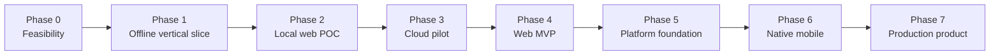
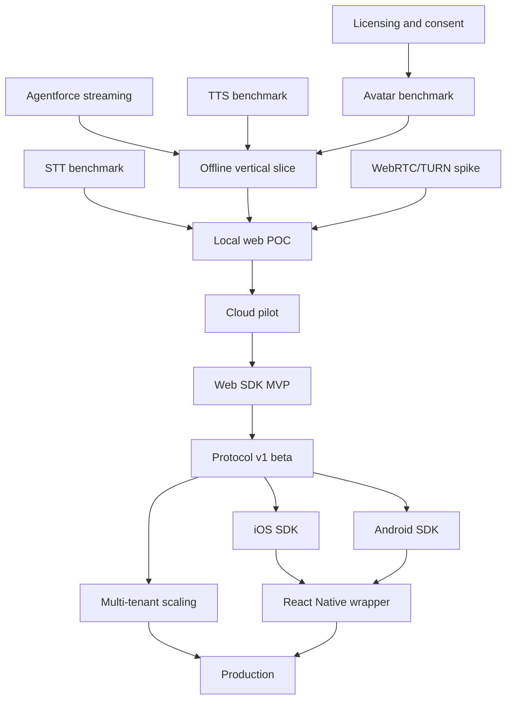

# AgenticAvatar Progressive Implementation Plan

A staged path from a browser proof of concept to a commercially deployable, cross-platform avatar product.

This plan is intentionally progressive. Each phase must prove a specific risk before the next phase adds cost or complexity. The first objective is not a polished platform—it is a working browser conversation that demonstrates acceptable Agentforce latency, voice quality, lip synchronization, and interruption behavior.

Related documents:

- [Architecture and technology stack](./README.md)
- [Comprehensive web and mobile implementation plan](./IMPLEMENTATION_PLAN.md)

## 1. Progressive strategy



The sequence answers these questions in order:

1. Can the selected avatar model render the chosen portrait in real time?
2. Can Agentforce, TTS, and the avatar produce one convincing response?
3. Can a browser sustain a natural, interruptible conversation?
4. Does it still work on real cloud infrastructure and real networks?
5. Will pilot users find it valuable and comfortable?
6. Is the architecture stable enough to expose as reusable SDKs?
7. Can native mobile applications integrate reliably?
8. Can the service operate securely, economically, and at scale?

## 2. Rules for controlling scope

- Do not start native mobile work until the browser protocol is stable.
- Do not build Kubernetes infrastructure for the first POC.
- Do not implement multi-region deployment before measuring real demand.
- Do not train a custom avatar model before testing existing models.
- Do not support arbitrary user-uploaded faces or voice cloning in the first release.
- Do not optimize for multiple simultaneous GPU sessions until one session is reliable.
- Do not build a React Native-specific media pipeline. It will wrap native SDKs later.
- Do not promise literal zero latency. Optimize measured end-to-first-audio latency.
- Do not progress to the next phase when the current phase's exit gate fails.

## 3. Target evolution

| Stage | Users | Client | Deployment | Primary proof |
| --- | --- | --- | --- | --- |
| Feasibility | Engineering team | Scripts | Local/cloud GPU | Model and license viability |
| Offline slice | Engineering team | Command line | Local services | Agentforce → voice → avatar quality |
| Web POC | Internal testers | One React web app | Local gateway + one GPU | Live conversation |
| Cloud pilot | Small invited group | Hosted web app | Google Cloud, one warm GPU | Network and cloud latency |
| Web MVP | Pilot customers | Embeddable Web SDK | Managed regional service | Product value and integration |
| Platform | Multiple tenants | Versioned APIs/SDK | Autoscaled regional service | Reusability and isolation |
| Mobile | Pilot mobile apps | iOS and Android SDKs | Same backend | Native integration reliability |
| Product | Production customers | Web/mobile SDKs | Hardened cloud platform | Scale, security, unit economics |

---

# Phase 0 — Feasibility and decisions

## Goal

Remove the highest-risk unknowns before building an application.

## Duration

Approximately 1–2 weeks.

## Build

- Confirm Salesforce Agentforce Agent API access in a sandbox.
- Verify streamed Agentforce response events and cancellation behavior.
- Select one approved test portrait and one approved voice.
- Run Ditto with prerecorded speech on an NVIDIA GPU.
- Test at 512×512 and 25 FPS.
- Benchmark an L4 and a stronger GPU if available.
- Compare at least two streaming TTS providers using representative Agentforce answers.
- Select one streaming STT provider or confirm the Agentforce Voice path.
- Inventory all code, model weights, face detectors, and landmark-model licenses.
- Decide whether to use managed LiveKit or a small `aiortc` prototype initially.

## Measure

- Avatar frame generation time.
- Encoding time.
- GPU memory per session.
- TTS time to first audio.
- STT partial and final transcript latency.
- Agentforce time to first user-facing text.
- Visual identity stability and lip-sync quality.

## Deliverables

- `docs/decisions/0001-avatar-model.md`
- `docs/decisions/0002-stt-provider.md`
- `docs/decisions/0003-tts-provider.md`
- `docs/decisions/0004-media-service.md`
- `benchmarks/phase-0-results.md`
- Dependency and model license inventory.
- Go/no-go recommendation.

## Exit gate

Proceed only when:

- The avatar sustains at least 25 FPS on a selected cloud GPU.
- The selected TTS begins producing audio quickly enough for streaming.
- Agentforce returns streamable user-facing text.
- The portrait looks acceptable during speech and silence.
- Every prototype dependency has an understood evaluation license.
- There is a credible commercial licensing/replacement path.

## Do not build yet

- User accounts.
- Mobile applications.
- Public SDKs.
- Autoscaling.
- Multi-tenancy.
- Kubernetes.

---

# Phase 1 — Offline vertical slice

## Goal

Prove the complete intelligence and rendering chain without browser or WebRTC complexity.

## Duration

Approximately 2 weeks.

## Flow

```text
Recorded WAV
  → speech-to-text
  → Agentforce streaming response
  → phrase chunker
  → streaming TTS
  → avatar renderer
  → synchronized MP4 output
```

## Build

- Minimal Python gateway.
- Salesforce OAuth token handling.
- Agentforce session start, streamed message, cancellation, and session close.
- First STT adapter.
- First TTS adapter.
- Phrase chunker that emits complete speakable clauses.
- GPU avatar-worker process with model loaded at startup.
- Offline audio/video muxing for review.
- Timing instrumentation around every pipeline stage.
- Generation IDs so cancelled/stale output can be rejected.

## Suggested repository subset

```text
services/
├── gateway/
└── avatar-worker/
packages/
├── agentforce-adapter/
├── stt-adapters/
├── tts-adapters/
└── contracts/
tests/
└── integration/
```

## Acceptance scenarios

- Basic greeting.
- Long Agentforce response split into natural TTS phrases.
- Response containing currency, dates, acronyms, and URLs.
- Agentforce action that takes several seconds.
- Cancellation before TTS starts.
- Cancellation while TTS is generating.
- Upstream error with a user-safe result.

## Exit gate

Proceed only when:

- A single command produces a complete response video.
- Speech matches the Agentforce response.
- Lip synchronization is acceptable in human review.
- No stage requires the complete Agentforce response or complete TTS file.
- Timing traces expose the latency contribution of every stage.
- Cancellation prevents old output from continuing.

## Do not build yet

- WebRTC.
- Polished UI.
- Tenant administration.
- Native mobile code.
- GPU autoscaling.

---

# Phase 2 — Local browser POC

## Goal

Demonstrate a natural, real-time conversation in one supported desktop browser.

## Duration

Approximately 3–4 weeks.

## Initial technology stack

| Component | Choice |
| --- | --- |
| Browser application | Next.js, React, TypeScript |
| Gateway | FastAPI, Python |
| Control channel | WebSocket |
| Media | LiveKit development instance or `aiortc` |
| Client capture | Web Audio API and `AudioWorklet` |
| Voice activity | WebRTC VAD |
| State | In-memory for one user; Redis optional |
| Avatar | Ditto/TensorRT worker on one warm GPU |
| Video | WebRTC H.264/VP8, 512×512, 25 FPS |
| Audio | WebRTC Opus |

## POC user interface

One page containing:

- Avatar video.
- Start conversation button.
- Microphone mute/unmute.
- Stop/interruption button.
- End session button.
- Listening/thinking/speaking indicator.
- User and agent captions.
- Text input fallback.
- Small developer panel showing current latency and FPS.

The interface can be visually simple. Interaction quality matters more than branding.

## Build order

### Step 2.1 — Session state machine

Implement:

```text
idle → connecting → listening → thinking → speaking
                      ↑              ↓          ↓
                      └──────── interrupted ────┘
```

Every transition must be explicit and observable. Do not infer state solely from UI events.

### Step 2.2 — Browser microphone

- Ask for permission after a user gesture.
- Capture mono PCM through `AudioWorklet`.
- Show local audio level.
- Run VAD and emit speech-start/speech-end events.
- Offer text input if permission is denied.

### Step 2.3 — Live STT and Agentforce

- Route microphone audio to streaming STT.
- Display partial transcripts for debugging.
- Finalize a turn using VAD plus STT endpointing.
- Send the final text to Agentforce.
- Display streamed Agentforce text.

### Step 2.4 — Streaming voice

- Send Agentforce phrases to TTS as soon as they are safe to speak.
- Play audio without waiting for the complete response.
- Maintain a small jitter buffer.
- Record time from user turn-end to first audible sample.

### Step 2.5 — Live avatar

- Feed the same TTS PCM stream into the avatar worker.
- Publish generated frames over WebRTC.
- Use TTS audio timestamps as the master clock.
- Drop late video frames instead of delaying audio.
- Add deterministic idle/blink/listening motion.

### Step 2.6 — Barge-in

- Detect user speech while the avatar is speaking.
- Stop local playback immediately.
- Increment the server-side generation number.
- Cancel current TTS and Agentforce processing where applicable.
- Flush avatar and media buffers.
- Reject all stale events and frames.

## POC targets

| Metric | Target |
| --- | ---: |
| Avatar render rate | ≥ 25 FPS |
| End-of-turn → first audible response, p50 | < 1.2 s |
| End-of-turn → first audible response, p95 | < 2.5 s |
| User interruption → silence, p95 | < 300 ms |
| A/V synchronization | within ±120 ms |
| Continuous test conversation | 10 minutes |

These are POC targets. Later phases tighten them.

## Exit gate

Proceed only when five internal testers can each complete a ten-minute conversation and:

- Speech feels conversational rather than batch-generated.
- Users can interrupt reliably.
- Audio never waits for video.
- No stale response resumes after interruption.
- The avatar maintains identity and acceptable lip synchronization.
- The latency trace identifies remaining bottlenecks.

## Do not build yet

- Public NPM SDK.
- iOS or Android apps.
- Customer billing.
- Multiple regions.
- Custom avatar uploads.
- Complex administration UI.

---

# Phase 3 — Google Cloud web pilot

## Goal

Move the working browser POC to real cloud infrastructure and validate it with a small invited group.

## Duration

Approximately 3–4 weeks.

## Deployment

```text
Web app                 → Cloud Run or Firebase Hosting
Session/gateway API     → Cloud Run, minimum instance 1
Redis                   → Memorystore
Media/TURN              → Managed LiveKit or dedicated Compute Engine/GKE
Avatar renderer         → One private, continuously warm GPU VM
Images                  → Artifact Registry
Portrait/model assets   → Private Cloud Storage
Secrets                 → Secret Manager
Telemetry               → OpenTelemetry + Cloud Monitoring/Logging
```

## Build

- Terraform for one development/pilot region.
- HTTPS, WebSocket, WebRTC, STUN, and TURN configuration.
- Private networking for the GPU worker.
- Short-lived client and media tokens.
- Simple allowlist or existing company authentication.
- Redis-backed session leases and generation state.
- Model readiness probe and startup benchmark.
- Basic capacity admission: return a friendly unavailable state when the GPU is occupied.
- Operational dashboard for latency, FPS, GPU memory, errors, packet loss, and active sessions.
- Session cleanup and automatic expiration.
- Raw-audio and transcript logging disabled by default.

## Pilot test matrix

- Home broadband.
- Corporate network.
- TURN-only network.
- Wi-Fi with simulated packet loss.
- Chrome, Edge, Safari, and Firefox.
- Desktop and mobile browser smoke tests.
- Thirty-minute session.
- GPU worker restart during an idle session.
- Agentforce, STT, and TTS timeout behavior.

## Pilot targets

| Metric | Target |
| --- | ---: |
| Session connection, p95 | < 4 s |
| End-of-turn → first audible response, p50 | < 1 s |
| End-of-turn → first audible response, p95 | < 2 s |
| Interruption → silence, p95 | < 250 ms |
| Avatar render rate | ≥ 25 FPS |
| A/V synchronization | within ±100 ms |
| Successful session establishment | ≥ 98% excluding permission denial |

## Exit gate

Proceed only when:

- At least 20 invited users complete real conversations.
- The most common latency and connection failures are understood.
- Cloud cost per active conversation minute is measured.
- TURN fallback works on restrictive networks.
- No credential or sensitive transcript appears in client code or telemetry.
- Product feedback supports continued investment.

---

# Phase 4 — Web MVP

## Goal

Turn the pilot into an embeddable web product suitable for a small number of design partners.

## Duration

Approximately 4–6 weeks.

## Product capabilities

- Reusable framework-independent TypeScript core.
- React provider, hook, avatar view, captions, and controls.
- Server-side session bootstrap API.
- Tenant-specific Agentforce agent, avatar, voice, and locale configuration.
- Reliable reconnect and token refresh.
- Accessible captions and text input.
- Configurable visual theme and layout primitives.
- Stable public state, event, method, and error contracts.
- Published integration guide and Next.js sample.

## SDK packages

```text
@agentic-avatar/core
@agentic-avatar/web
@agentic-avatar/react
```

## Minimum host integration

The customer's backend creates a session using a server credential. Its browser receives only a short-lived bootstrap response:

```tsx
<AgenticAvatarProvider
  getSessionBootstrap={() => fetch("/api/avatar/session").then(r => r.json())}
  captions
  bargeIn
>
  <AvatarVideo />
  <AvatarControls />
  <AvatarCaptions />
</AgenticAvatarProvider>
```

## Hardening

- Idempotent session creation.
- Backward-compatible versioned contracts.
- Per-tenant quotas.
- CSP and secure browser integration guidance.
- Stable error codes with correlation IDs.
- Automatic reconnect without duplicate sessions or tracks.
- Dependency/license scanning.
- Cross-browser automated tests and physical Safari testing.
- Privacy disclosure and retention configuration.

## Web MVP targets

| Metric | Target |
| --- | ---: |
| First audible response, p50 | < 800 ms |
| First audible response, p95 | < 1.8 s |
| Interruption → local silence, p95 | < 150 ms |
| Interruption → backend cancellation, p95 | < 250 ms |
| A/V synchronization | within ±80 ms |
| Successful session establishment | ≥ 99.5% excluding permission denial |
| Thirty-minute session | No unrecoverable drift |

## Exit gate

Proceed only when:

- Two design partners integrate using documentation and the public SDK.
- No internal source-code modification is needed for integration.
- The Web SDK contract is stable enough to become the mobile contract.
- Security, privacy, consent, and prototype commercial licensing are reviewed.
- Measured retention/usage suggests product value.

---

# Phase 5 — Platform foundation

## Goal

Create the shared product backend required by both web and future native mobile SDKs.

## Duration

Approximately 4–6 weeks.

## Build

- Versioned OpenAPI session contract.
- Versioned WebSocket/AsyncAPI event contract.
- Protobuf avatar-worker contract.
- Client conformance fixtures and expected state transitions.
- Tenant configuration service.
- API credentials or workload-identity integration.
- Tenant-scoped session, rate, concurrency, and retention policy.
- Multiple GPU workers with leasing and session affinity.
- Admission control and bounded waiting behavior.
- Rolling deployment without dropping all active sessions.
- Software bill of materials and container signing.
- Operational runbooks and alerts.
- SDK compatibility policy and semantic versioning.

## Scaling sequence

1. Measure sessions per GPU at 512×512 and 25 FPS.
2. Set a conservative per-worker capacity.
3. Keep minimum warm capacity for expected traffic.
4. Add workers based on active leases and GPU utilization.
5. Reject/queue safely before overload affects active sessions.
6. Increase resolution only when latency and cost budgets allow it.

## Exit gate

Proceed to mobile when:

- Protocol v1 beta is frozen.
- Web SDK passes all conformance fixtures.
- Session recovery and token renewal behavior are documented.
- Backend supports multiple tenants without shared credentials or data leakage.
- GPU worker scaling has a measured safe capacity.

---

# Phase 6 — Native mobile applications

## Goal

Expose the same avatar experience in native iOS and Android applications without changing the backend conversation protocol.

## Duration

Approximately 6–10 weeks with iOS and Android developed in parallel. Longer with one mobile engineer.

## Phase 6A — iOS SDK and sample app

Build:

- Swift Package: `AgenticAvatarSDK`.
- Optional SwiftUI components: `AgenticAvatarUI`.
- Native WebRTC/media-provider integration.
- Native video renderer.
- `AVAudioSession` configuration for voice communication.
- Speaker, receiver, wired-headset, and Bluetooth routing.
- Phone/Siri/audio interruption recovery.
- Foreground/background/foreground lifecycle behavior.
- Swift concurrency API plus observable state.
- SwiftUI sample application and UIKit integration example.
- VoiceOver, Dynamic Type, captions, and reduced-motion behavior.

Important boundary:

- Version 1 guarantees foreground conversation only.
- Background audio is deferred until its product use case and platform-policy requirements are approved.

Exit gate:

- Ten-minute conversations pass on physical iPhones.
- Repeated connect/disconnect does not leak microphone, renderer, or peer-connection resources.
- Audio routing and interruption recovery pass the supported-device matrix.
- The SDK passes the same protocol conformance suite as the Web SDK.

## Phase 6B — Android SDK and sample app

Build:

- Kotlin Android library published through Maven.
- Optional Jetpack Compose UI module.
- Native WebRTC/media-provider integration.
- Native video renderer.
- `AudioManager` communication mode and audio-focus handling.
- Speaker, earpiece, wired-headset, and Bluetooth routing.
- Lifecycle, activity recreation, and process-pressure handling.
- Coroutines and `StateFlow` public API.
- Compose sample application and View-based integration example.
- TalkBack, font scaling, captions, and reduced-motion behavior.

Important boundary:

- Version 1 guarantees foreground conversation only.
- Do not introduce a foreground service until persistent background conversation is a validated requirement.

Exit gate:

- Ten-minute conversations pass on representative physical Android devices.
- Activity recreation does not create duplicate backend sessions.
- Repeated sessions release the EGL context, renderer, microphone, and peer connection.
- The SDK passes the same protocol conformance suite as web and iOS.

## Phase 6C — React Native wrapper

Start only after the native SDK contracts stabilize.

Build:

- Thin TypeScript API over iOS and Android SDKs.
- Native avatar-view bridge.
- Typed events and commands.
- React Native demonstration application.

Do not move audio capture, WebRTC processing, or video rendering onto the JavaScript thread.

Exit gate:

- Native and React Native applications show equivalent behavior.
- Navigation and lifecycle changes do not duplicate or leak sessions.
- Release builds pass on both platforms.

---

# Phase 7 — Full product and production scale

## Goal

Operate a secure, reliable, commercially approved avatar platform for web and mobile customers.

## Duration

Continuous product development after successful design-partner validation.

## Product capabilities

- Customer/tenant administration.
- Agent, avatar, voice, locale, quota, and retention configuration.
- Usage metering and billing integration.
- Production support tools using metadata rather than sensitive content.
- Consent and asset-provenance records.
- Avatar/voice approval workflow.
- Customer-facing usage and quality dashboards.
- Regional capacity and data-residency choices where required.
- Provider failover for STT/TTS if justified by measured incidents.
- SDK release channels, migration guides, and deprecation policy.

## Production infrastructure

- Multiple warm GPU workers per active region.
- Automated capacity management with admission control.
- Zero-downtime CPU service deployment.
- Controlled GPU worker draining.
- Disaster-recovery plan for durable configuration.
- Secret rotation.
- Tenant-scoped audit logging.
- Alerts on latency, frame rate, A/V drift, capacity, and provider errors.
- Regular load, network-degradation, failover, and security tests.

## Production governance

- Commercial-license approval for all code and model dependencies.
- Documented rights for each avatar portrait and voice.
- AI-avatar disclosure.
- Privacy impact assessment.
- Data retention and deletion verification.
- Incident-response process.
- Abuse prevention and rate limiting.
- Accessibility review for web, iOS, and Android.

## Production exit criteria

- Web, iOS, and Android SDKs can be integrated from published documentation.
- Production SLOs hold at agreed peak concurrency.
- Cost per active conversation minute is understood and sustainable.
- No critical security, privacy, accessibility, or licensing issue remains open.
- Consent, retention, deletion, and support workflows operate end-to-end.
- Rollback, incident, and capacity-exhaustion procedures have been exercised.

---

# Program workstream dependencies



## Progressive team plan

### Phases 0–1

Minimum team:

- One backend/Agentforce engineer.
- One ML/inference engineer.
- Part-time product/design and security/licensing support.

### Phases 2–3

Add:

- One web engineer.
- One realtime media engineer or someone experienced with WebRTC.
- Part-time platform/SRE support.

### Phases 4–5

Add or allocate:

- Platform/SRE ownership.
- SDK/API ownership.
- QA automation.
- Security/privacy review.

### Phase 6 onward

Add:

- iOS engineer.
- Android engineer.
- Dedicated product design/accessibility support.
- Customer integration/support capability.

## Decision checkpoints

At the end of every phase, record one of four decisions:

- **Proceed:** exit gate passed.
- **Repeat:** approach works but targets require another iteration.
- **Pivot:** replace a provider, model, media layer, or architecture component.
- **Stop:** user value, licensing, performance, or economics do not justify proceeding.

The decision record must include:

- Test population and environment.
- Measured latency percentiles.
- GPU performance and cost.
- Failure categories.
- Human evaluation results.
- Licensing/security/privacy status.
- Scope and budget for the next phase.

## Metrics dashboard by phase

### Technical metrics

- Agentforce time to first user-facing text.
- TTS time to first audio.
- End-of-user-turn to first browser/device audio.
- Interruption-to-local-silence.
- Interruption-to-backend-cancellation.
- Avatar frame generation time and FPS.
- GPU utilization and memory.
- Audio/video synchronization offset.
- WebRTC RTT, jitter, packet loss, and reconnect count.
- Session connection success and duration.
- Error rate by provider and platform.

### Product metrics beginning in the pilot

- Conversation starts and completions.
- Median session duration.
- Turns per session.
- User interruption frequency.
- Permission-denial rate.
- Text-fallback usage.
- User-rated naturalness, responsiveness, and trust.
- Repeat usage.
- Cost per active conversation minute.

Do not optimize engagement by making disclosure unclear or encouraging users to mistake the avatar for a human.

## Recommended immediate sprint

The next sprint should contain only Phase 0 work:

1. Verify Agentforce sandbox credentials and streamed message endpoint.
2. Select an approved portrait and test voice.
3. Run Ditto offline with prerecorded audio.
4. Measure FPS, VRAM, and encoding on an L4-class GPU.
5. Benchmark two streaming TTS candidates.
6. Benchmark streaming STT endpointing.
7. Create the dependency/model license inventory.
8. Choose LiveKit versus `aiortc` for the browser POC.
9. Record the results and make the Phase 1 go/no-go decision.

Avoid beginning mobile code, Terraform modules, tenant administration, or visual polish during this sprint. The highest-value result is evidence that the core conversational avatar can meet the required quality and latency.
