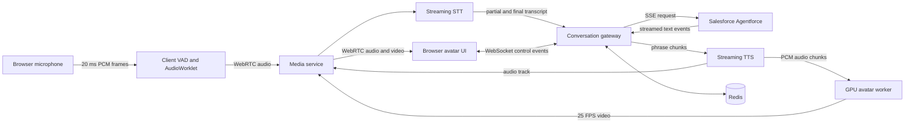

# AgenticAvatar

Real-time, human-like speaking avatar powered by a Salesforce Agentforce agent.

This document defines the recommended production architecture, technology stack, service contracts, implementation phases, cloud deployment, security controls, and latency targets.

For delivery planning, see:

- [PROGRESSIVE_IMPLEMENTATION_PLAN.md](./PROGRESSIVE_IMPLEMENTATION_PLAN.md) for the staged POC-to-product roadmap.
- [IMPLEMENTATION_PLAN.md](./IMPLEMENTATION_PLAN.md) for detailed web, iOS, Android, and React Native implementation requirements.

> **Reality check:** networked AI cannot provide literal zero latency. This project targets less than 1 second from the end of the user's turn to the first audible response, immediate visual feedback, and uninterrupted 25 FPS avatar rendering. The interaction should *feel* real-time even though every pipeline stage has measurable latency.

## 1. Product goals

The application must:

- Let a user speak naturally through a browser microphone.
- Detect when the user starts and stops speaking.
- Send the conversation to an existing Salesforce Agentforce agent.
- Stream the agent's reply instead of waiting for the complete response.
- Generate natural speech incrementally.
- Produce synchronized mouth, face, head, blink, gaze, and idle motion.
- Render the avatar at 25 FPS or better.
- Allow the user to interrupt the avatar at any time.
- Keep Salesforce, TTS, and cloud credentials outside the browser.
- Run on Google Cloud or AWS with a continuously warm GPU.

## 2. Recommended stack

| Layer | Recommended technology | Reason |
| --- | --- | --- |
| Web client | Next.js, React, TypeScript | Mature browser media and UI ecosystem |
| Client audio | AudioWorklet, Web Audio API | Low-latency PCM capture without blocking the UI |
| Realtime transport | WebRTC | Low-latency audio/video, jitter handling, congestion control |
| Control transport | WebSocket | Session events, transcripts, state, interruption commands |
| Edge/API | FastAPI, Python 3.11+, Uvicorn | Works well with async streaming and the Python ML stack |
| Turn detection | WebRTC VAD initially; neural turn detector later | Fast local speech boundaries with an upgrade path |
| Speech-to-text | Streaming STT provider or Agentforce Voice-compatible STT | Partial transcripts and low endpointing latency |
| Agent | Salesforce Agentforce Agent API | Existing business logic and Salesforce actions |
| Speech synthesis | Streaming TTS provider | Incremental PCM output with low time-to-first-audio |
| Avatar motion | Ditto for the first self-hosted prototype | Audio-driven, real-time talking-head pipeline |
| Avatar renderer | TensorRT-optimized renderer | Predictable GPU latency |
| Media server | LiveKit or a small aiortc service for the prototype | WebRTC session and track management |
| Session/cache | Redis | Ephemeral session state, cancellation, worker routing |
| Primary database | PostgreSQL only if durable application data is required | Do not store audio by default |
| Containers | Docker | Reproducible CPU and GPU services |
| Infrastructure | Terraform | Repeatable Google Cloud/AWS deployment |
| Observability | OpenTelemetry plus cloud-native logs/metrics | End-to-end latency tracing |

### Avatar model decision

Use **Ditto** first because the required input is synthesized speech audio, not a human driving video. The original LivePortrait repository is useful as a renderer and research foundation, but its default file-oriented driving-video workflow is not the right production interface.

Evaluate **AVTR-1** as a second prototype if active listening behavior materially improves the experience. Its renderer and streamer have commercial-license restrictions, so do not ship it commercially without legal review and the required licenses.

Before commercial release, audit every repository, model weight, face detector, landmark model, font, voice, and source portrait. In particular, replace noncommercial InsightFace pretrained detection models or obtain the appropriate license.

## 3. System architecture



### Service boundaries

#### Web client

Responsibilities:

- Ask for microphone permission only after explicit user interaction.
- Capture mono audio through an `AudioWorklet`.
- Resample to the STT provider's required rate, normally 16 kHz PCM16.
- Run lightweight voice activity detection.
- Publish the microphone as a WebRTC audio track.
- Render the returned avatar video and audio tracks.
- Send `interrupt`, `mute`, `unmute`, and session lifecycle events.
- Show explicit states: `connecting`, `listening`, `thinking`, `speaking`, `interrupted`, and `error`.

#### Conversation gateway

Responsibilities:

- Authenticate the application user.
- Create and close Agentforce sessions.
- Hold Salesforce credentials and refresh tokens server-side.
- Consume partial/final STT events.
- Call the Agentforce streaming endpoint.
- Convert streamed Agentforce text into speakable phrase chunks.
- Send phrases to streaming TTS.
- Propagate cancellation through Agentforce, TTS, media, and avatar generation.
- Record timing metrics without logging sensitive transcript content by default.

The gateway is CPU-only and scales independently from GPU workers.

#### Media service

Responsibilities:

- Establish WebRTC connections.
- Receive microphone audio.
- Publish synthesized speech and avatar video.
- Preserve audio/video timestamps and lip synchronization.
- Provide STUN/TURN fallback for restrictive networks.
- Report packet loss, jitter, bitrate, and round-trip time.

Use LiveKit for a production-ready deployment or `aiortc` for a small proof of concept. A TURN server such as coturn is required for reliable enterprise-network connectivity.

#### GPU avatar worker

Responsibilities:

- Load the avatar model and TensorRT engines once during startup.
- Preprocess and cache the selected portrait's identity features.
- Accept small PCM audio chunks for one assigned session.
- Generate continuous motion and 25 FPS frames.
- Produce idle/listening animation before speech begins.
- Timestamp frames from the same media clock as synthesized audio.
- Flush queued frames immediately on interruption.

Do not expose the GPU worker directly to the public internet.

## 4. Realtime conversation flow

### Session startup

1. Browser calls `POST /v1/sessions` through the application backend.
2. Gateway authenticates the user and creates an Agentforce session.
3. Scheduler assigns a warm GPU worker and stores the lease in Redis.
4. Media service returns a short-lived WebRTC token and ICE configuration.
5. Browser establishes WebRTC and WebSocket connections.
6. GPU worker emits a listening/idle stream immediately.

### User turn

1. `AudioWorklet` emits 20 ms microphone frames.
2. VAD sends a `speech_started` event and cancels current avatar speech if necessary.
3. Streaming STT produces partial transcript events.
4. When endpointing detects a completed turn, the gateway sends the final text to Agentforce.
5. UI changes from `listening` to `thinking`; the avatar continues natural listening/idle motion.

### Agent turn

1. Gateway consumes Agentforce's SSE stream.
2. A phrase chunker waits for a safe boundary such as punctuation or a short timeout.
3. The first meaningful phrase is sent to TTS immediately.
4. TTS streams PCM chunks simultaneously to the browser audio track and avatar worker.
5. Avatar worker generates corresponding face motion and video frames.
6. Media service publishes synchronized audio/video tracks through WebRTC.

### Barge-in/interruption

When the user starts speaking while the avatar is talking:

1. Client VAD emits `interrupt` with the current turn ID.
2. Browser immediately lowers/stops remote audio playback.
3. Gateway invalidates the active turn using a monotonic generation number.
4. Gateway cancels TTS and requests Agentforce cancellation when appropriate.
5. Media service drops queued audio/video after the interruption timestamp.
6. GPU worker resets its audio/motion buffer and returns to listening motion.

Every asynchronous message must contain `sessionId`, `turnId`, and `generation`. Consumers must discard stale generations. This prevents late TTS or model frames from speaking after interruption.

## 5. Latency budget

Target measured from **detected end of user speech** to **first audible synthesized audio**:

| Stage | Target p50 | Target p95 |
| --- | ---: | ---: |
| End-of-turn detection | 150 ms | 300 ms |
| Gateway and Agentforce first useful text | 250 ms | 700 ms |
| Phrase chunking | 40 ms | 120 ms |
| TTS first audio | 150 ms | 350 ms |
| Network and playback buffer | 60 ms | 150 ms |
| **Total** | **650 ms** | **1,620 ms** |

Avatar rendering must run faster than real time:

- 25 FPS means one frame every 40 ms.
- Five frames represent 200 ms of output; generation must take less than 200 ms.
- Maintain only a small render buffer, normally 2–4 frames.
- Drop late video frames rather than delaying audio.
- Audio is the master clock; video follows its timestamps.

The initial production objective is p50 below 800 ms and p95 below 1.8 seconds. Optimize only after collecting distributed traces from real conversations.

## 6. Repository layout

```text
AgenticAvatar/
├── apps/
│   └── web/                    # Next.js browser application
├── services/
│   ├── gateway/                # FastAPI orchestration service
│   ├── media/                  # LiveKit integration or aiortc prototype
│   └── avatar-worker/          # CUDA/TensorRT model server
├── packages/
│   ├── contracts/              # JSON Schema/OpenAPI-generated shared types
│   └── telemetry/              # Trace names and metric helpers
├── infra/
│   ├── modules/                # Reusable Terraform modules
│   ├── gcp/                    # Primary Google Cloud deployment
│   └── aws/                    # AWS equivalent
├── models/                     # Download manifests only; no weights in Git
├── scripts/                    # Development and benchmark commands
├── tests/
│   ├── integration/
│   ├── load/
│   └── media-quality/
├── .env.example
├── docker-compose.yml          # CPU services for local development
└── README.md
```

## 7. API and event contracts

### Create session

```http
POST /v1/sessions
Authorization: Bearer <application-user-token>
Content-Type: application/json

{
  "avatarId": "support-agent-01",
  "locale": "en-US",
  "clientTimeZone": "America/New_York"
}
```

Example response:

```json
{
  "sessionId": "ses_01...",
  "websocketUrl": "wss://api.example.com/v1/sessions/ses_01/events",
  "mediaToken": "short-lived-token",
  "mediaUrl": "wss://media.example.com",
  "expiresAt": "2026-08-31T18:30:00Z"
}
```

### WebSocket envelope

```json
{
  "type": "turn.interrupt",
  "sessionId": "ses_01...",
  "turnId": "turn_07...",
  "generation": 3,
  "sequence": 42,
  "sentAt": "2026-08-31T18:20:10.245Z",
  "payload": {}
}
```

Core event types:

- `session.ready`
- `speech.started`
- `speech.ended`
- `transcript.partial`
- `transcript.final`
- `agent.thinking`
- `agent.text.delta`
- `avatar.speaking`
- `turn.interrupt`
- `turn.cancelled`
- `session.error`
- `session.closed`

Binary media must remain on WebRTC. Do not send rendered video frames through JSON WebSocket messages.

### Internal avatar stream

For the first implementation, use bidirectional gRPC between the media/gateway layer and GPU worker:

```protobuf
service AvatarRenderer {
  rpc OpenSession(OpenSessionRequest) returns (OpenSessionResponse);
  rpc Stream(stream RenderInput) returns (stream RenderOutput);
  rpc CloseSession(CloseSessionRequest) returns (CloseSessionResponse);
}

message RenderInput {
  string session_id = 1;
  string turn_id = 2;
  uint64 generation = 3;
  uint64 timestamp_ms = 4;
  oneof input {
    bytes pcm_s16le = 5;
    ControlEvent control = 6;
  }
}

message RenderOutput {
  string session_id = 1;
  string turn_id = 2;
  uint64 generation = 3;
  uint64 presentation_timestamp_ms = 4;
  bytes encoded_frame = 5;
  bool keyframe = 6;
}
```

Use raw frames only on the same machine. Across machines, encode with NVIDIA NVENC using H.264 baseline/main profile or VP8 if required by the chosen WebRTC stack.

## 8. Salesforce Agentforce integration

The gateway must implement the Agent API session lifecycle:

1. Obtain a Salesforce OAuth token server-side.
2. Start an Agentforce session and map its ID to the application session.
3. Send the user's final transcript to the streaming message endpoint.
4. Parse the Server-Sent Events incrementally.
5. Forward only user-facing response text to the phrase chunker.
6. End the Agentforce session when the application session closes or expires.

Do not call Salesforce directly from the browser. Store OAuth client credentials in the cloud secret manager. Cache access tokens only in server memory or encrypted Redis with a TTL shorter than the Salesforce token lifetime.

The phrase chunker should:

- Emit immediately after sentence-ending punctuation.
- Emit at a comma or clause boundary after roughly 12–20 words.
- Emit after a 100–180 ms silence in the text stream when enough text exists.
- Avoid sending incomplete URLs, numbers, dates, abbreviations, or Markdown syntax to TTS.
- Strip citations and UI-only formatting from spoken output.

## 9. Avatar preparation

For each allowed avatar:

1. Obtain written consent and document image/voice usage rights.
2. Use a sharp, evenly lit, front-facing portrait with a neutral expression.
3. Crop and normalize it to the model's expected resolution.
4. Replace or remove the background before runtime if desired.
5. Run face detection and identity feature extraction offline.
6. Store the normalized portrait and cached identity features in private object storage.
7. Load the cached identity representation when a GPU session begins.

Never allow arbitrary public portrait uploads in the first release. That creates moderation, consent, impersonation, and GPU-abuse risks. If uploads are added later, require consent confirmation, malware scanning, face-count validation, moderation, rate limits, and automatic deletion.

## 10. Google Cloud deployment (recommended)

### Services

| Component | Google Cloud service |
| --- | --- |
| Web application | Cloud Run or Firebase Hosting plus Cloud CDN |
| Gateway | Cloud Run, minimum instances 1 |
| Media | GKE Standard or Compute Engine; managed LiveKit is also acceptable |
| Avatar worker | Compute Engine G2/L4 for development; stronger GPU after benchmark |
| Container images | Artifact Registry |
| Session state | Memorystore for Redis |
| Portrait assets | Private Cloud Storage bucket |
| Secrets | Secret Manager |
| Metrics/logs | Cloud Monitoring and Cloud Logging |
| DNS/TLS | Cloud DNS and HTTPS Load Balancer |

### GPU configuration

- Use a Linux NVIDIA GPU VM with CUDA and TensorRT versions pinned to the model build.
- Start with an L4 for functional testing.
- Benchmark an L40/L40S-class option if the L4 cannot render faster than real time with encoding enabled.
- Keep at least one GPU worker running continuously.
- Build TensorRT engines on the same GPU architecture used in production.
- Run a startup benchmark before the worker reports readiness.
- Remove unhealthy workers when frame generation exceeds the real-time threshold.

Cloud Run GPU can be evaluated later, but an always-on Compute Engine or GKE GPU worker offers simpler control over long-lived WebRTC sessions, model warmup, GPU memory, and predictable latency.

### Network

- Deploy all application components in one region near the expected users.
- Put private services in a VPC.
- Allow public traffic only to the HTTPS/WebSocket gateway, WebRTC ingress, and TURN endpoints.
- Use internal DNS/service discovery for gateway-to-worker calls.
- Configure UDP load balancing according to the media platform's requirements.

## 11. AWS equivalent

| Google Cloud | AWS equivalent |
| --- | --- |
| Cloud Run gateway | ECS Fargate or App Runner |
| Compute Engine G2/L4 | EC2 G6/L4 |
| GKE | EKS |
| Artifact Registry | ECR |
| Memorystore | ElastiCache for Redis |
| Cloud Storage | S3 |
| Secret Manager | Secrets Manager |
| Cloud Monitoring | CloudWatch plus X-Ray/ADOT |
| HTTPS Load Balancer | ALB/NLB and CloudFront |

For AWS, run GPU containers on ECS backed by G6 instances. Evaluate fractional G6f capacity only after measuring VRAM and compute requirements per concurrent session. Keep CPU gateway tasks separate from the GPU capacity provider.

## 12. Configuration

Never commit real secrets. The eventual `.env.example` should contain names only:

```dotenv
APP_ENV=development
PUBLIC_APP_URL=http://localhost:3000
GATEWAY_PUBLIC_URL=http://localhost:8000
REDIS_URL=redis://localhost:6379/0

SALESFORCE_LOGIN_URL=https://login.salesforce.com
SALESFORCE_CLIENT_ID=
SALESFORCE_CLIENT_SECRET=
SALESFORCE_AGENT_ID=

STT_PROVIDER=
STT_API_KEY=
TTS_PROVIDER=
TTS_API_KEY=
TTS_VOICE_ID=

MEDIA_URL=
MEDIA_API_KEY=
MEDIA_API_SECRET=
TURN_URL=
TURN_USERNAME=
TURN_CREDENTIAL=

AVATAR_WORKER_TARGET=localhost:50051
AVATAR_MODEL_PATH=/models/ditto
AVATAR_ASSET_BUCKET=
OTEL_EXPORTER_OTLP_ENDPOINT=
```

## 13. Security and privacy

- Use short-lived signed media tokens.
- Authenticate WebSocket upgrades.
- Authorize every session and avatar selection server-side.
- Encrypt traffic in transit and storage at rest.
- Keep all third-party credentials in the cloud secret manager.
- Use least-privilege service accounts/IAM roles.
- Disable transcript and raw-audio logging by default.
- Define explicit retention periods for transcripts, recordings, and metrics.
- Add per-user session limits and API rate limiting.
- Prevent server-side request forgery in any asset import feature.
- Add a visible disclosure that the user is interacting with an AI-generated avatar.
- Add a watermark when appropriate for the product context.
- Record consent and provenance for every avatar image and cloned/custom voice.
- Perform a model and dependency license audit before commercialization.

## 14. Observability

Create one trace per conversation turn and propagate the trace ID through the gateway, Agentforce adapter, TTS adapter, media service, and avatar worker.

Required metrics:

- `turn_end_to_agent_first_text_ms`
- `turn_end_to_tts_first_audio_ms`
- `turn_end_to_browser_first_audio_ms`
- `avatar_frame_generation_ms`
- `avatar_render_fps`
- `avatar_late_frame_count`
- `audio_video_sync_offset_ms`
- `webrtc_rtt_ms`
- `webrtc_packet_loss_ratio`
- `active_sessions`
- `active_gpu_sessions`
- `gpu_utilization_ratio`
- `gpu_memory_used_bytes`
- `interrupt_to_silence_ms`
- Agentforce, STT, and TTS error/timeout counts

Never attach raw audio, access tokens, full Salesforce responses, or sensitive transcripts to traces.

## 15. Testing strategy

### Unit tests

- Phrase boundary detection
- SSE event parsing
- Stale-generation rejection
- Cancellation propagation
- Token refresh behavior
- State machine transitions

### Integration tests

- Synthetic microphone audio through STT to Agentforce to TTS
- TTS PCM through avatar worker to encoded frames
- Browser WebRTC negotiation through TURN
- Agentforce timeout and reconnect behavior
- User interruption during every pipeline stage

### Performance tests

- Time to first audio at p50/p95/p99
- Stable FPS for 30-minute sessions
- GPU sessions per worker at 512×512 and 25 FPS
- Audio/video synchronization drift
- Packet loss and high-latency network simulation
- Autoscaling while maintaining warm capacity

### Human evaluation

Use consented evaluators to score:

- Lip synchronization
- Voice naturalness
- Identity consistency
- Listening behavior
- Turn-taking speed
- Interruption responsiveness
- Overall comfort and trust

## 16. Implementation plan

### Phase 0 — benchmarks and licensing

- Confirm Agentforce streaming access and authentication.
- Select STT and TTS providers through a measured latency test.
- Run Ditto using one approved portrait and sample TTS audio.
- Measure L4 and L40S-class GPU performance including NVENC.
- Audit code and model licenses.
- Define whether commercial avatar/voice use is allowed.

**Exit condition:** selected pipeline sustains at least 25 FPS and all components have an acceptable commercial path.

### Phase 1 — offline vertical slice

- Build gateway adapters for Agentforce and TTS.
- Submit prerecorded user speech.
- Stream Agentforce text into the phrase chunker.
- Render the generated speech through the avatar worker.
- Save an audio/video artifact for sync inspection.

**Exit condition:** one complete turn has good lip sync and correct Agentforce content.

### Phase 2 — live single-user prototype

- Implement browser AudioWorklet and VAD.
- Add WebSocket control channel.
- Add WebRTC audio/video.
- Keep one warm GPU worker.
- Implement interruption and stale-generation handling.
- Instrument all latency stages.

**Exit condition:** ten-minute conversations stay synchronized and interruptions silence output within 250 ms.

### Phase 3 — cloud MVP

- Deploy CPU gateway and Redis.
- Deploy private GPU worker.
- Configure TURN, TLS, IAM, secrets, and monitoring.
- Add authenticated user sessions.
- Run load and failure tests.

**Exit condition:** p50 first audio below 800 ms under expected load, with no credential exposure or stale speech after interruption.

### Phase 4 — production hardening

- Add worker leasing and session affinity.
- Add warm-capacity autoscaling.
- Add multi-region routing only after single-region performance is stable.
- Add moderation, consent records, deletion workflows, and audit logs.
- Conduct security, privacy, accessibility, and commercial-license reviews.

## 17. Initial engineering decisions

1. Agentforce remains the conversational brain.
2. The avatar layer is audio-driven; the original LivePortrait CLI is not used as the live API.
3. Audio is the master synchronization clock.
4. WebRTC carries media; WebSocket carries state and control events.
5. GPU workers remain warm and private.
6. Every turn supports cancellation and generation-based stale-message rejection.
7. Begin at 512×512 and 25 FPS; increase resolution only after latency goals are met.
8. Do not train a custom avatar model for the MVP.
9. Do not store user audio by default.
10. Google Cloud is the reference deployment; AWS remains a supported equivalent.

## 18. Immediate next steps

1. Obtain an approved avatar portrait and voice with documented usage rights.
2. Confirm the Agentforce agent ID, OAuth application, and streaming API access.
3. Choose two STT/TTS candidates and benchmark time to first partial transcript/audio.
4. Deploy Ditto on a local or cloud NVIDIA GPU and measure 25 FPS performance.
5. Implement the offline vertical slice before introducing WebRTC.
6. Use the measured results to choose L4 versus L40S-class production capacity.

## References

- [Salesforce Agent API guide](https://developer.salesforce.com/docs/ai/agentforce/guide/agent-api.html)
- [Salesforce Agent API reference](https://developer.salesforce.com/docs/ai/agentforce/references/agent-api)
- [LivePortrait](https://github.com/KlingAIResearch/LivePortrait)
- [Ditto talking head](https://github.com/antgroup/ditto-talkinghead)
- [AVTR-1](https://github.com/avaturn-live/avtr-1)
- [Google Cloud GPU overview](https://cloud.google.com/compute/docs/gpus/overview)
- [Google Cloud G2 machine types](https://cloud.google.com/compute/docs/gpus#l4-gpus)
- [AWS ECS GPU workloads](https://docs.aws.amazon.com/AmazonECS/latest/developerguide/ecs-gpu.html)
